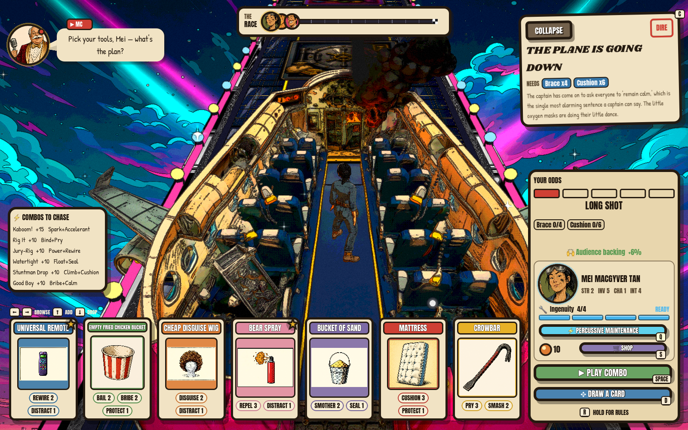

# Josh Lans — Project Portfolio

Three production systems I designed and built in about a year, on my own, alongside a full-time job — across three completely different domains. Here's what each one is, with the depth a click away.

> I build production software fast by directing AI tools the way a lead directs a team. The repeatable method behind all three is open-sourced: **[agentic-dev-kit](https://github.com/josh-lans/agentic-dev-kit)**.

---

## 1. MonLite — Enterprise Observability Platform

An enterprise monitoring platform (SAP, six databases, servers, web services) built to replace a seven-figure commercial product. Python/FastAPI control plane, distributed collector agents, a React UI, an air-gapped AI diagnostic assistant, and automatic failover — proven against 3,000+ production systems and 200+ concurrent users.

📄 **[Full write-up →](monlite.md)** · architecture deep-dives in [`architecture/`](architecture/) · more screens in [`screenshots/`](screenshots/)

---

## 2. Pathfinder — AI-Augmented SAP Migration Tool

A decision-support tool that turns SAP-to-cloud migrations from a static playbook into a tailored, interactive plan for each customer. A multi-LLM engine drafts the plan, suggests improvements, and answers questions with sourced citations — and it gets smarter with every completed migration.

📄 **[Read more →](pathfinder.md)**

---

## 3. Disaster Scenario — Cross-Platform Multiplayer Game

A comedic board-deckbuilder party game for Steam and mobile, built end to end in Godot 4 — proof the same approach works far outside enterprise software. Its 3D art was produced with a multi-agent AI pipeline (one model briefs, another generates, a third renders).

📄 **[Read more →](disaster-scenario.md)** · 🎮 **[Full showcase & gallery →](https://github.com/josh-lans/disaster-scenario-game)**

---

*Joshua Lans · [github.com/josh-lans](https://github.com/josh-lans) · [LinkedIn](https://www.linkedin.com/in/joshualans/)*
