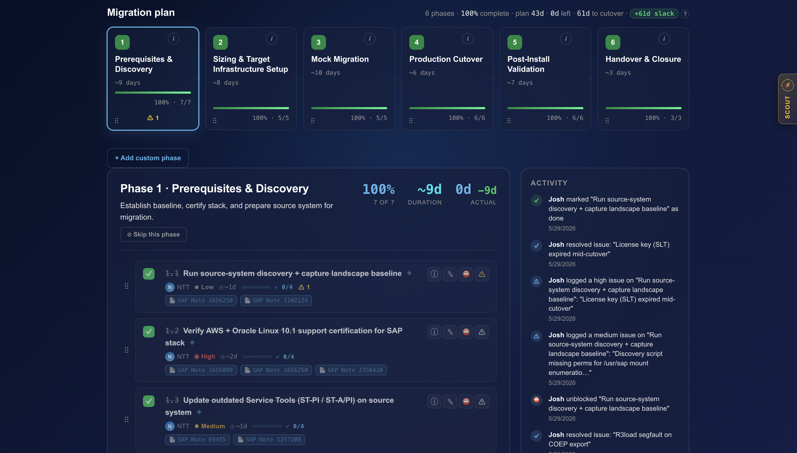
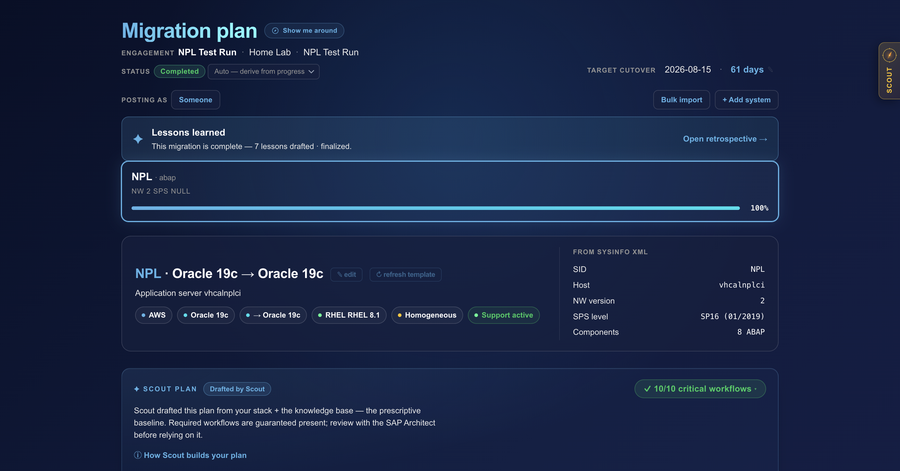
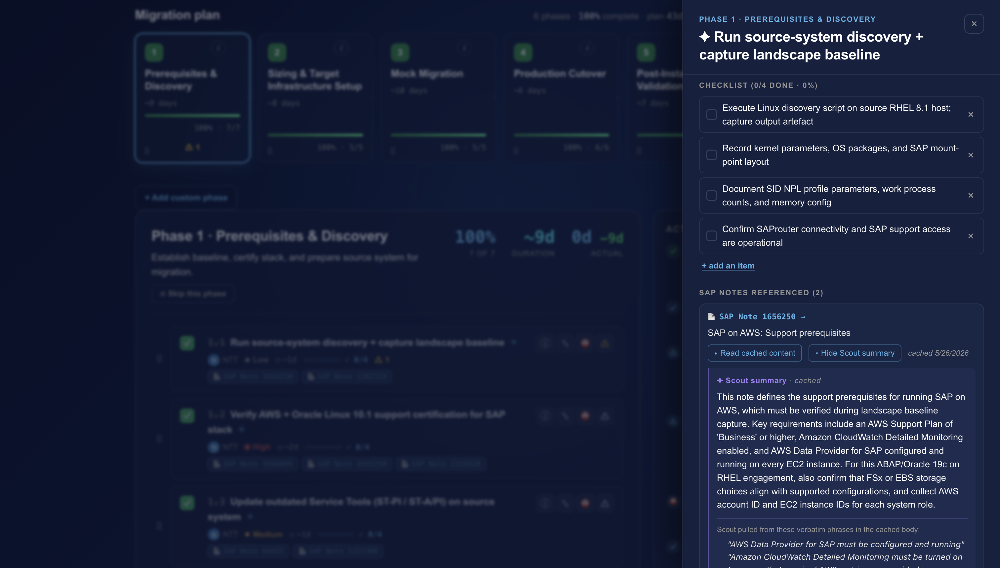
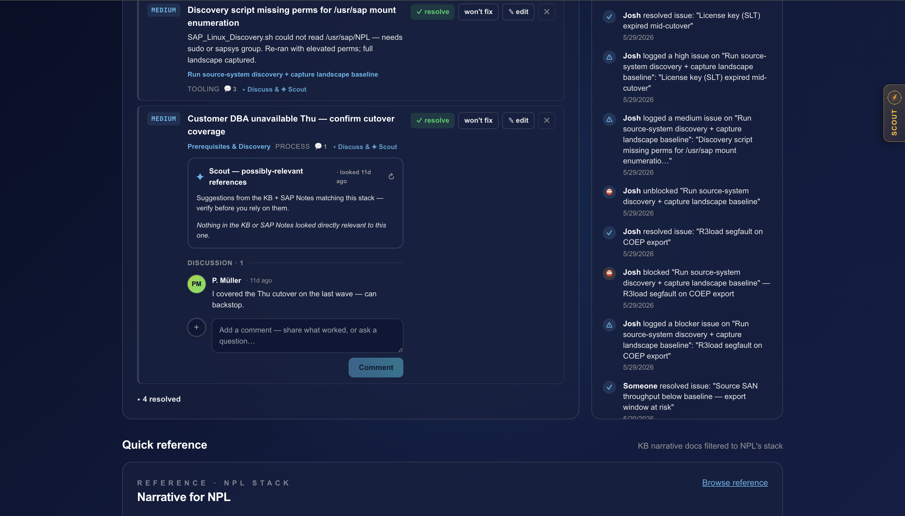
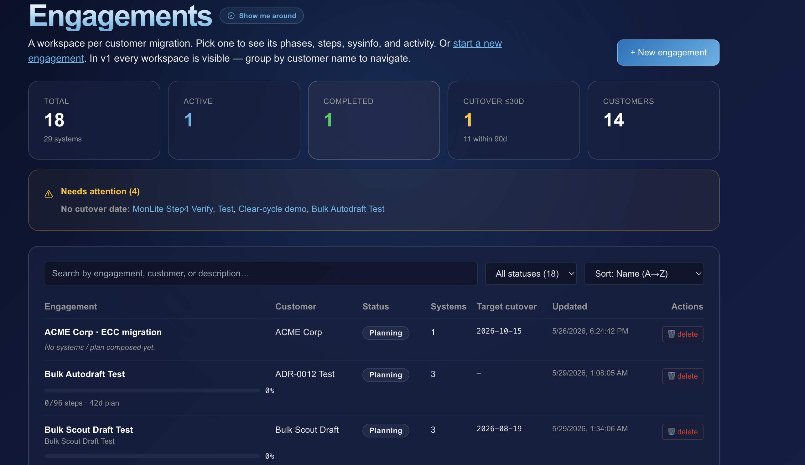

# Pathfinder — AI-Augmented SAP Migration Tool

*An internal decision-support platform. NTT DATA initiative. Capability-level overview — no proprietary code.*

[← Back to portfolio](README.md)

## The problem

SAP-to-cloud migrations involve dozens of decision variables — source database and version, OS, target platform (AWS / Azure / GCP / RISE), downtime tolerance, support agreements. The institutional knowledge lived in a static, 300+ line playbook document that couldn't tailor itself to a specific customer's landscape.

## What it does

An operator answers a short set of questions about a customer's SAP environment. Pathfinder composes a **tailored, interactive migration plan** — the right phased steps, the SAP Notes that apply to *that* stack, pre-flight checks, and discovery scripts — instead of a one-size-fits-all document.

## A look at it

**Scout drafts the plan from your stack and the knowledge base** — the prescriptive baseline, with required workflows guaranteed present.

**Every step links the exact SAP Notes, each with a Scout summary grounded in the cached note** (verbatim phrases cited, never invented).

**Issues are tracked per step, with Scout surfacing relevant SAP Notes and the team discussing inline.**

**Every customer migration is its own workspace.**

## How it's built

- **Stack:** Python / FastAPI with async SQLAlchemy on PostgreSQL; React + TypeScript frontend.
- **"Scout," a multi-provider LLM engine** (Anthropic, Gemini, OpenAI-compatible, Ollama) that drafts full phased plans, proposes targeted enhancements, and answers grounded questions with **classified citations** — using whichever model fits the task.
- **A cumulative-intelligence loop:** lessons from completed migrations are captured, ratified, and fed forward into future plans, so the tool keeps improving.
- **Guardrails:** server-side validators keep advice stack-correct, and an operator-state-preservation contract means AI edits never overwrite a human's work.
- **Enterprise-ready:** multi-provider single sign-on, role-based access, and a tamper-evident audit trail.

## Why it matters

Pathfinder is the second proof point — after MonLite — that a disciplined, multi-agent AI development approach compounds across very different business problems. It reused proven subsystems from MonLite (provider routing, security, validation) rather than reinventing them.

---

*Joshua Lans · [github.com/josh-lans](https://github.com/josh-lans) · [LinkedIn](https://www.linkedin.com/in/joshualans/)*
